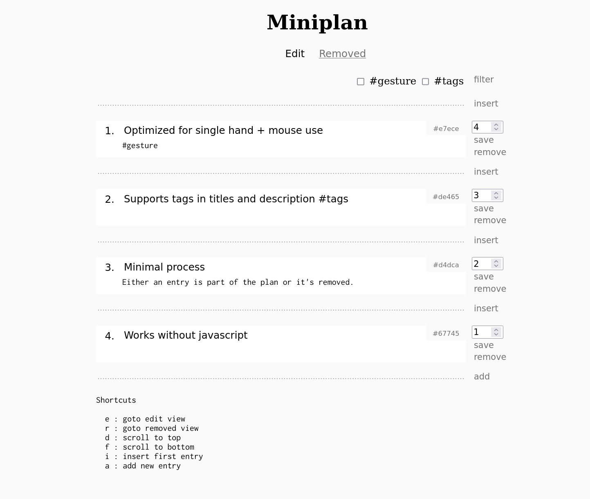

miniplan - simple planning service with no fuss

## Quick start

    $ go install github.com/gregoryv/miniplan@latest
	
or download a binary release and then run the service

    $ miniplan --plan-file myplan.json
    create myplan.json
    listens on http://localhost:9180

open your browser to the url shown.

